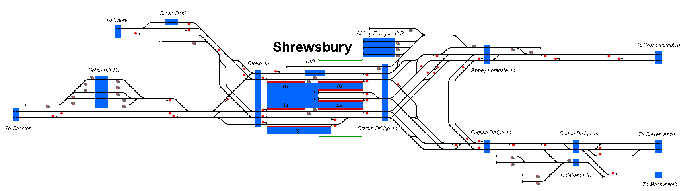

# Shrewsbury, UK
Simulation of Shrewsbury Railway Station, in Shrewsbury, Shropshire, UK.

## Current Status

| Stage         | Status        |
| ------------- |:-------------:|
| Track Plan     | :heavy_check_mark: |
| Signalling      | :heavy_check_mark:      |
| Naming | :heavy_check_mark:      |
| Speed Limits | :heavy_check_mark: |
| Distances | :heavy_check_mark: |
| Timetable | :heavy_check_mark: |
| Documentation | :x: |

## Data Sources

- [Map Meurisse](https://map.meurisse.org/)
- [OpenTrainTimes](https://www.opentraintimes.com/)
